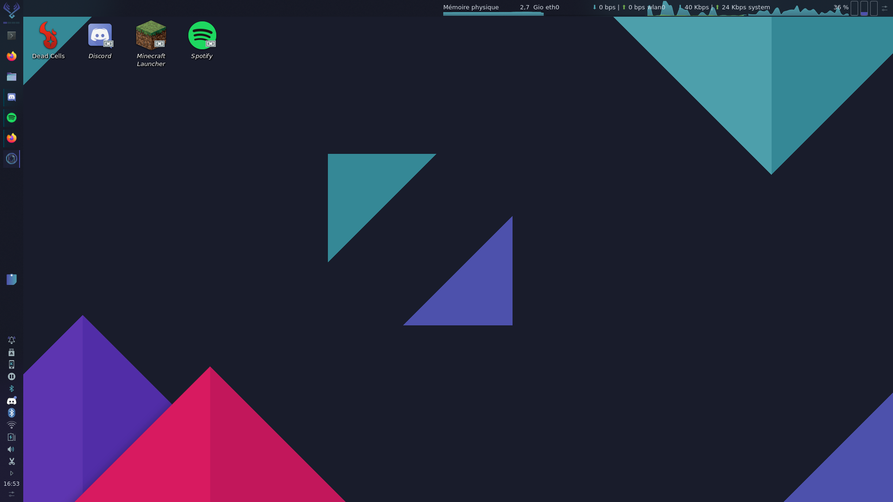

# Sensual-theme WM (Only on KDE)

[Download theme](https://store.kde.org/p/1373828/)

[Download KDE](https://kde.org/download/)

How to install a theme on Parrot OS:
  1. Search on application search bar "Global theme"
  2. Select Add new global theme
  3. Search your theme
  4. Click on install
  5. Go back to theme selection
  6. Select your theme
  
  [Theme by L4ki](https://github.com/L4ki/Sensual-Theme)
